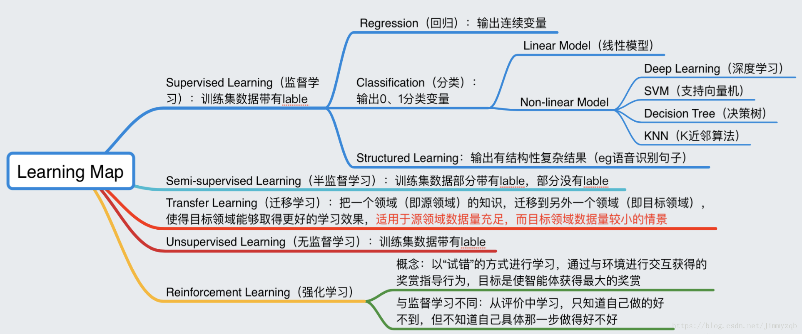

# 大鱼AI🐟 ：李宏毅机器学习(台湾大学)

## 课程资料
1. [课程主页](http://speech.ee.ntu.edu.tw/~tlkagk/courses_ML17_2.html)  
2. [课程笔记](https://blog.csdn.net/dukuku5038/article/details/82253966)  
3. [课程视频](https://www.bilibili.com/video/av10590361?from=search&seid=8516959386096686045)  
4. [环境配置Anaconda](https://github.com/learning511/Stanford-Machine-Learning-camp/tree/master)
5. [作业介绍]()
6. 比赛环境推荐使用Linux或者Mac系统，以下环境搭建方法皆适用:  
    [Docker环境配置](https://github.com/ufoym/deepo)  
    [本地环境配置](https://github.com/learning511/cs224n-learning-camp/blob/master/environment.md)

## 重要一些的资源：
1. [深度学习经典论文](https://github.com/floodsung/Deep-Learning-Papers-Reading-Roadmap.git)
2. [深度学习斯坦福教程](http://deeplearning.stanford.edu/wiki/index.php/UFLDL%E6%95%99%E7%A8%8B)
3. [廖雪峰python3教程](https://www.liaoxuefeng.com/article/001432619295115c918a094d8954bd493037b03d27bf9a9000)
4. [github教程](https://www.liaoxuefeng.com/wiki/0013739516305929606dd18361248578c67b8067c8c017b000)
5. [莫烦机器学习教程](https://morvanzhou.github.io/tutorials)
6. [深度学习经典论文](https://github.com/floodsung/Deep-Learning-Papers-Reading-Roadmap.git)
7. [机器学习代码修行100天](https://github.com/Avik-Jain/100-Days-Of-ML-Code)  
8. [吴恩达机器学习新书：machine learning yearning](https://github.com/AcceptedDoge/machine-learning-yearning-cn)  
9. [Dr.Wu 专栏(机器学习专题)](https://blog.csdn.net/dukuku5038/column/info/28363)  
10. [Dr.Wu 专栏(深度学习专题)](https://blog.csdn.net/column/details/28693.html)  
11. [自上而下的学习路线: 软件工程师的机器学习)](https://github.com/ZuzooVn/machine-learning-for-software-engineers/blob/master/README-zh-CN.md)  

## 1. 前言
### 中文世界中最好的机器学习课程！

李宏毅老师的机器学习和深度学习系列课程，是中文世界中最好！课程中有深入浅出的讲解和幽默生动的比喻（还有口袋妖怪哦）。关键一切都是中文的！（除了课件^_^）

本课程李宏毅老师的机器学习核心内容带学，作业讲解。主要包括：

（一）监督学习（回归、分类、BP反向传播、梯度下降）

（二）无监督学习（AutoEncoder、Neighbor Embedding、Deep Generative Model）

（三）迁移学习 （Transfer learning）

（四）结构化学习（Structure learning）

本课程每课都有课件，每周都有配套作业代码，十分推荐推荐学习。

## 2.数学知识复习  
1.[线性代数](http://web.stanford.edu/class/cs224n/readings/cs229-linalg.pdf)  
2.[概率论](http://web.stanford.edu/class/cs224n/readings/cs229-prob.pdf)  
3.[凸函数优化](http://web.stanford.edu/class/cs224n/readings/cs229-cvxopt.pdf)  
4.[随机梯度下降算法](http://cs231n.github.io/optimization-1/)  

#### 中文资料：    
- [机器学习中的数学基本知识](https://www.cnblogs.com/steven-yang/p/6348112.html)  
- [统计学习方法](http://vdisk.weibo.com/s/vfFpMc1YgPOr)  
**大学数学课本（从故纸堆里翻出来^_^）**  

### 3.编程工具
#### 斯坦福资料：
- [Python复习](http://web.stanford.edu/class/cs224n/lectures/python-review.pdf)  

#### 4. 中文书籍推荐：
- 《机器学习》周志华  

- 《统计学习方法》李航  

- 《机器学习课》邹博  

## 5. 学习安排
本课程需要8周共15节课，
每周具体时间划分为4个部分:  
- 1部分安排周一到周二  
- 2部分安排在周四到周五  
- 3部分安排在周日  
- 4部分作业是本周任何时候空余时间    
- 周日晚上提交作业运行截图  
- 周三、周六休息^_^  

#### 6.作业提交指南：  
 训练营的作业自检系统已经正式上线啦！只需将作业发送到训练营公共邮箱即可，知识星球以打卡为主，不用提交作业。以下为注意事项:  
~~<0> 课程资料：[链接]() 密码：
<1> 训练营代码公共邮箱：NTU-ML@xx.com  
<2> [查询自己成绩:]()  
<3> 将每周作业压缩成zip文件，文件名为“学号+作业编号”，例如："NTU-ML-010037-01.zip"  
<4> 注意不要改变作业中的"方法名","类名"不然会检测失败！~~

## 7.学习安排
一、整体学习脑图

二、具体学习计划
### week 1  
**学习准备**  
**知识点复习**  
**学习组队**  

**第1节： 引言(Introduction)**  
**课件：**[lecture1](https://github.com/dafish-ai/NTU-Machine-learning/blob/master/%E6%9D%8E%E5%BC%98%E6%AF%85-%E6%9C%BA%E5%99%A8%E5%AD%A6%E4%B9%A0-%E8%AF%BE%E4%BB%B6/1-introduction.pdf)  
**笔记：**[lecture1-note1](https://blog.csdn.net/dukuku5038/article/details/82347021)  
**视频：**  
	1.1 欢迎:[Welcome to Machine Learning](https://www.bilibili.com/video/av10590361/?p=1)  
	1.2 为什么要学习机器学习？:[Why learning ？](https://www.bilibili.com/video/av10590361/?p=2)  
**作业 Week1：**:  
[制定自己的学习计划，开通自己的学习博客，注册自己的github](https://github.com/dafish-ai/NTU-Machine-learning/blob/master/%E6%9D%8E%E5%BC%98%E6%AF%85-%E6%9C%BA%E5%99%A8%E5%AD%A6%E4%B9%A0-%E4%BD%9C%E4%B8%9A/Week1-CSDN%E5%8D%9A%E5%AE%A2%E4%B8%8EGithub%E5%88%9B%E5%BB%BA.md)

---

### week 2
**第2节： 回归问题**  
**课件：**[lecture2](https://github.com/dafish-ai/NTU-Machine-learning/blob/master/%E6%9D%8E%E5%BC%98%E6%AF%85-%E6%9C%BA%E5%99%A8%E5%AD%A6%E4%B9%A0-%E8%AF%BE%E4%BB%B6/2-Regression.pdf)  
**笔记：**[lecture2-note2](https://blog.csdn.net/dukuku5038/article/details/82503111)  
**视频：**  
	2.1 回归:[Regression](https://www.bilibili.com/video/av10590361/?p=3)  
	2.2 回归 Demo:[Demo](https://www.bilibili.com/video/av10590361/?p=4)  

**第3节： 错误分析**  
**课件：**[lecture3](https://github.com/dafish-ai/NTU-Machine-learning/blob/master/%E6%9D%8E%E5%BC%98%E6%AF%85-%E6%9C%BA%E5%99%A8%E5%AD%A6%E4%B9%A0-%E8%AF%BE%E4%BB%B6/3-Bias%20and%20Variance%20(v2).pdf)  
**笔记：**[lecture3-note3](https://blog.csdn.net/dukuku5038/article/details/82682855)  
**视频：**  
	2.3 错误从哪里来[Error Handle](https://www.bilibili.com/video/av10590361/?p=5)  

**作业 Week2：**:  
  纯python[线性回归](https://github.com/learning511/Stanford-Machine-Learning-camp/blob/master/Assignments/machine-learning-ex1/ex1.pdf/)  	

---------------------------------------------------------

### week 3   
**第4节： 梯度下降(Gradient Descent )**  
**课件：**[lecture4](https://github.com/dafish-ai/NTU-Machine-learning/blob/master/%E6%9D%8E%E5%BC%98%E6%AF%85-%E6%9C%BA%E5%99%A8%E5%AD%A6%E4%B9%A0-%E8%AF%BE%E4%BB%B6/4-Gradient%20Descent%20(v2).pdf)  
**笔记：**[lecture4-note4](https://blog.csdn.net/dukuku5038/article/details/83608873)  
**视频：**  
	3.1梯度下降:[Gradient Descent](https://www.bilibili.com/video/av10590361/?p=6)  
	3.2梯度下降Demo1:[Gradient Descent Demo1](https://www.bilibili.com/video/av10590361/?p=7)  
	3.3梯度下降Demo2:[Gradient Descent Demo2](https://www.bilibili.com/video/av10590361/?p=8)  

**作业 Week3：**:  
  [PM2.5 预测](https://ntumlta.github.io/2017fall-ml-hw1/)  

---------------------------------------------------------

### Week 4  
**第5节：分类：概率生成模型（Classification：Probabilistic Generative Model）**  
**课件：**[lecture5](https://github.com/dafish-ai/NTU-Machine-learning/blob/master/%E6%9D%8E%E5%BC%98%E6%AF%85-%E6%9C%BA%E5%99%A8%E5%AD%A6%E4%B9%A0-%E8%AF%BE%E4%BB%B6/5-Classification%20(v3).pdf)  
**笔记：**[lecture5-note5](https://blog.csdn.net/dukuku5038/article/details/82698867)  
**视频：**  
	4.1分类：概率生成模型:[Classification：Probabilistic Generative Model](https://www.bilibili.com/video/av10590361/?p=10)  

**第6节：分类：逻辑回归（Logistic Regression）**  
**课件：**[lecture6](https://github.com/dafish-ai/NTU-Machine-learning/blob/master/%E6%9D%8E%E5%BC%98%E6%AF%85-%E6%9C%BA%E5%99%A8%E5%AD%A6%E4%B9%A0-%E8%AF%BE%E4%BB%B6/6-Logistic%20Regression%20(v3).pdf)  
**笔记：**[lecture6-note6](https://blog.csdn.net/dukuku5038/article/details/82585523)  
**视频：**  
	4.2分类：逻辑回归:[Logistic Regression](https://www.bilibili.com/video/av10590361/?p=11)   

**作业 Week4：**:

收入预测[Winner or Loser](https://ntumlta.github.io/2017fall-ml-hw2)  

---------------------------------------------------------

### Week 5     
**第7节：深度学习简介(Introduction to Deep learning)**  
**课件：**[lecture7](https://github.com/dafish-ai/NTU-Machine-learning/blob/master/%E6%9D%8E%E5%BC%98%E6%AF%85-%E6%9C%BA%E5%99%A8%E5%AD%A6%E4%B9%A0-%E8%AF%BE%E4%BB%B6/7-DL%20(v2).pdf)  
**笔记：**[lecture7-note7](https://blog.csdn.net/dukuku5038/article/details/83217542)  
**视频：**                                  
	5.1 深度度学习简介:[Introduction to Deep learning](https://www.bilibili.com/video/av10590361/?p=13)  
	5.2 反向传播算法：[Back Prppagation](https://www.bilibili.com/video/av10590361/?p=14))  

**第8节：“Hello world” of Deep learning**
**课件：**[lecture8](https://github.com/dafish-ai/NTU-Machine-learning/blob/master/%E6%9D%8E%E5%BC%98%E6%AF%85-%E6%9C%BA%E5%99%A8%E5%AD%A6%E4%B9%A0-%E8%AF%BE%E4%BB%B6/9-keras.pdf)  
**笔记：**[lecture8-note8](https://blog.csdn.net/dukuku5038/article/details/83721330)  
**视频：**                                  
	5.1 [DeepLearning Demo](https://www.bilibili.com/video/av10590361/?p=15)  
	5.2  Keras Demo：[Demo](https://www.bilibili.com/video/av10590361/?p=16)  
	5.2  Keras Demo1：[Demo1](https://www.bilibili.com/video/av10590361/?p=17)  

**第9节：深度学习技巧 Deep learning tips**  
**课件：**[lecture9](https://github.com/dafish-ai/NTU-Machine-learning/blob/master/%E6%9D%8E%E5%BC%98%E6%AF%85-%E6%9C%BA%E5%99%A8%E5%AD%A6%E4%B9%A0-%E8%AF%BE%E4%BB%B6/10-DNN%20tip.pdf)  
**笔记：**[lecture8-note9](https://blog.csdn.net/dukuku5038/article/details/83680923)  
**视频：**                                  
	5.3 [DeepLearning tips](https://www.bilibili.com/video/av10590361/?p=18)  
	5.4  Keras Demo2：[Demo2](https://www.bilibili.com/video/av10590361/?p=19)  

**作业 Week5：**:  
（1）深度神经网络[Keras实现手写数字识别](https://github.com/dafish-ai/NTU-Machine-learning/blob/master/%E6%9D%8E%E5%BC%98%E6%AF%85-%E6%9C%BA%E5%99%A8%E5%AD%A6%E4%B9%A0-%E4%BD%9C%E4%B8%9A/Week5%20-%20%20Keras%E5%AE%9E%E7%8E%B0%E6%89%8B%E5%86%99%E6%95%B0%E5%AD%97%E8%AF%86%E5%88%AB.md)

---------------------------------------------------------

### Week 6  
**第10节：卷积神经网络(CNN)**
**课件：**[lecture10](https://github.com/dafish-ai/NTU-Machine-learning/blob/master/%E6%9D%8E%E5%BC%98%E6%AF%85-%E6%9C%BA%E5%99%A8%E5%AD%A6%E4%B9%A0-%E8%AF%BE%E4%BB%B6/11-CNN.pdf)  
**笔记：**[lecture10-note10](https://blog.csdn.net/dukuku5038/article/details/83735926)  
**视频：**  
	6.1 卷积神经网络:[CNN](https://www.bilibili.com/video/av10590361/?p=21)  

**第11节：为什么要深度学习（Why Deep)**
**课件：**[lecture11](https://github.com/dafish-ai/NTU-Machine-learning/blob/master/%E6%9D%8E%E5%BC%98%E6%AF%85-%E6%9C%BA%E5%99%A8%E5%AD%A6%E4%B9%A0-%E8%AF%BE%E4%BB%B6/12-Why-deep.pdf)  
**笔记：**[lecture11-note11]()  
**视频：**  
	6.2 为什么要深度学习:[CNN](https://www.bilibili.com/video/av10590361/?p=22)  

**作业 Week6：**:  
 【英文】：面部情绪分类[Image Classification](https://ntumlta.github.io/ML-Assignment3/index.html) 
 【中文】：面部情绪分类[Image Classification](https://github.com/dafish-ai/NTU-Machine-learning/blob/master/%E6%9D%8E%E5%BC%98%E6%AF%85-%E6%9C%BA%E5%99%A8%E5%AD%A6%E4%B9%A0-%E4%BD%9C%E4%B8%9A/Week6-Image%20Sentiment%20Classification-%E4%BD%9C%E4%B8%9A%E8%A6%81%E6%B1%82.md)

---------------------------------------------------------
### Week 7
**第12节：循环神经网络(RNN)**
**课件：**[lecture12](https://github.com/dafish-ai/NTU-Machine-learning/blob/master/%E6%9D%8E%E5%BC%98%E6%AF%85-%E6%9C%BA%E5%99%A8%E5%AD%A6%E4%B9%A0-%E8%AF%BE%E4%BB%B6/13-RNN%20(v2).pdf)  
**笔记：**[lecture12-note12](https://blog.csdn.net/dukuku5038/article/details/83830994)  
**视频：**  
	7.1 循环神经网络:[RNN](https://www.bilibili.com/video/av10590361/?p=36)  

**第13节：循环神经网络（LSTM、GRU)**
**课件：**[lecture13](https://github.com/dafish-ai/NTU-Machine-learning/blob/master/%E6%9D%8E%E5%BC%98%E6%AF%85-%E6%9C%BA%E5%99%A8%E5%AD%A6%E4%B9%A0-%E8%AF%BE%E4%BB%B6/13-RNN%20(v2).pdf)  
**笔记：**[lecture13-note13](https://blog.csdn.net/dukuku5038/article/details/83870172)  
**视频：**  
	7.2 循环神经网络:[LSTM，GRU](https://www.bilibili.com/video/av10590361/?p=37)  

**作业 Week7：**:

Twitter文本情绪分类[Text Sentiment](https://ntumlta.github.io/2017fall-ml-hw4))

【英文】：Twitter文本情绪分类[Text Sentiment](https://ntumlta.github.io/2017fall-ml-hw4) 
【中文】：Twitter文本情绪分类[Text Sentiment](李弘毅-机器学习-作业/Week7-Text%20Sentiment%20Classification-作业要求.md)

---------------------------------------------------------
### Week 8
**第14节：迁移学习**
**课件：**[lecture14](https://github.com/dafish-ai/NTU-Machine-learning/blob/master/%E6%9D%8E%E5%BC%98%E6%AF%85-%E6%9C%BA%E5%99%A8%E5%AD%A6%E4%B9%A0-%E8%AF%BE%E4%BB%B6/16-transfer%20(v3).pdf)  
**笔记：**[lecture14-note14]()  
**视频：**  
	8.1 迁移学习:[Transfer learning](https://www.bilibili.com/video/av10590361/?p=30)  

**第15节：强化学习（Reinforcement learning)**

**课件：**[lecture15](https://github.com/dafish-ai/NTU-Machine-learning/blob/master/%E6%9D%8E%E5%BC%98%E6%AF%85-%E6%9C%BA%E5%99%A8%E5%AD%A6%E4%B9%A0-%E8%AF%BE%E4%BB%B6/17-RL%20(v6).pdf)  
**笔记：**[lecture15-note15](https://blog.csdn.net/dukuku5038/article/details/84810898)  
**视频：**  
	8.2 强化学习:[Reinforcement learning](https://www.bilibili.com/video/av10590361/?p=39)  

**作业 Week8：**:

【英文】：小车爬山环境简介[MountainCarContinuous-V0](https://gym.openai.com/envs/MountainCarContinuous-v0/)  
【中文】：小车爬坡作业问题[MountainCarContinuous-V0](https://github.com/dafish-ai/NTU-Machine-learning/blob/master/%E6%9D%8E%E5%BC%98%E6%AF%85-%E6%9C%BA%E5%99%A8%E5%AD%A6%E4%B9%A0-%E4%BD%9C%E4%B8%9A/Week8-MountainCarContinuous-V0%20-%E4%BD%9C%E4%B8%9A%E8%A6%81%E6%B1%82%E4%B8%8E%E7%8E%AF%E5%A2%83.md)

---

## 联系我们： 
官网：[点击进入](http://www.dayufish.com/)  
官方公众号：

