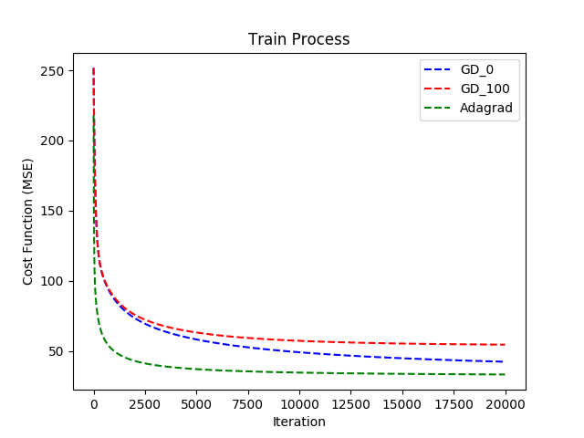

# Homework 1

## Purpose: Predict PM2.5

本次作業的資料是從中央氣象局網站下載的真實觀測資料，希望利用linear regression或其他方法預測PM2.5的數值。

## Data 簡介

* 本次作業使用豐原站的觀測記錄，分成train set跟test set，train set是豐原站每個月的前20天所有資料。test set則是從豐原站剩下的資料中取樣出來。

* train.csv：每個月前20天的完整資料，總共有5652筆train data，每筆資料維度為162。

* test.csv：從剩下的資料當中取樣出連續的10小時為一筆，前九小時的所有觀測數據當作feature，第十小時的PM2.5當作answer。一共取出240筆不重複的test data，請根據feauure預測這240筆的PM2.5。

## Summary 總結

本次的作業中我們對linear model執行gradient descent(GD)和Adagrad，最後使用公式解來檢查是否執行正確。

如果使用gradient descent(GD)，learning rate必須要調很小(至少1e-6)，也就是說要達到好的訓練結果必須花費較多的時間。

另外也對GD進行L2正規化，可以發現當懲罰項的lambda參數設定比較大的時候(下圖紅色GD_10,lambda=100)，模型會趨近於保守，也就是說參數更新會比較慢，收斂速度也會下降。

在Adagrad演算法的部分，收斂數度相對於GD快很多，由下圖中可以發現疊代5000次左右，參數就已經趨於平緩。GD_100(lambda=100)似乎也趨近於平緩，但cost function 相對於Adagrad來說還是比較大的。

 

Adagrad跟GD最大的差別在於Adagrad考慮了過去以往的gradient去更新參數。另外在訓練的過程中可以從cost function下降的過程中發現Adagrad更新速度會越來越慢，主要原因還是因為adagrad考慮了過去所有的gradient所導致的結果。Adagrad還有一個好處就是參數相對於GD來說好調。

最後我們將GD 和Adagrad 跟公式解做預測的比較，可以發現整體的趨勢大致符合，這也說明了我們的執行的GD和Adagrad是沒有問題的。

 

## Reference

* [原始課程作業說明](https://docs.google.com/presentation/d/1L1LwpKm5DxhHndiyyiZ3wJA2mKOJTQ2heKo45Me5yVg/edit#slide=id.g1eabbd760e_0_487)

* [Adagrad](https://www.youtube.com/watch?v=yKKNr-QKz2Q&feature=youtu.be&list=PLJV_el3uVTsPy9oCRY30oBPNLCo89yu49&t=705)