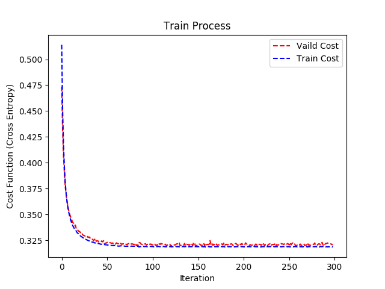

# Homework 2

## Purpose: Binary Classification

本次作業是需要從給定的個人資訊，預測此人的年收入是否大於50K。

## Data 簡介

* 本次作業使用 [ADULT dataset](https://archive.ics.uci.edu/ml/datasets/Adult)

Barry Becker從1994年的人口普查數據庫中進行了提取。 
（（AGE> 16）&&（AGI> 100）&&（AFNLWGT> 1）&&（HRSWK> 0））提取了一組合理清潔的記錄。

* 共有32561筆訓練資料，16281筆測試資料，其中資料維度為106。

## Summary 總結

本次作業執行 generative model 和 discriminative model。

- generative model 的困難點在於要假設資料的分配和變數之間的關係，如果資料越符假設的分配效果也就越好
- discriminative model 的難點則是在於如何選擇超參數

### Logistic Regression

一般對於二元分類最常用的方法為邏輯式回歸(Logistic Regression)，其背後有一些統計的推導過程，在此就不多做說明，簡單說邏輯式回歸跟一般線性回歸差別只在於計算線性回歸之後再利用sigmoid函數將數值轉換到0~1之間，另外將轉換過的的數值透過門檻值來區分類別，而門檻值得設置可以根據資料的不同來做設計，常用門檻值為0.5。

在這作業我們將所有的訓練資料中的20%當成驗證集，藉由另外80%的資料集來訓練參數。並使用 Mini-batch Gradient Descent 演算法來訓練邏輯式回歸的參數W和B，門檻值則用最一般的方式設置0.5。由下圖可以清楚的看出隨著疊代次數越來越多，不論是訓練集或是驗證集的 Cross entropy 都越來越小，且趨近於一致。這也就說明了模型參數學習得不錯。最後在測試集的預測精準度為85%。

### Probabilstic Generative Model

由於我們的目標是將資料進行二元分類，可以假設年收入大於50(y=1)為類別和年收入小於50(y=0)為類別且各為106維的常態分配，且每個特徵是獨立的，其中變異數矩陣共用，最後藉由最大估計法直接計算參數的最佳解。

擁有了模型的參數，我們藉由機率的方式來決定資料是屬於哪個類別，也就是說，分別計算資料來自於第一類的機率和第二類的機率以及資料在第一類的機率和第二類的機率，最後藉由上述這些機率去計算資料屬於第一類的機率和第二類的機率，最後藉此機率決定資料類別。

在此作業我們假設資料來自於常態分配，主要的原因還是因為數學推導相對而言比較簡單加上常態分配相對而言比較直觀，當然要假設其他機率分配也是可行的，例如像是0和1的類別資料，假設百努力分配相對於常態分配就會比較合理，另外假設每個特徵是獨立的也就是使用 Naive Bayes Classifier。

在這 case 底下我們的預測精準度大約76%，相對於 discriminative model 的 Logistic Regression 略差一些。另外我們做了很多的假設，像是資料來自於兩個常態分配且變異數矩陣使用相同的參數，以及特徵之間是獨立，但可能這些資料並不符合這些假設，這也是這個模型的預測率相對於 Logistic Regression 差的原因。

## Reference

* [原始課程作業說明](https://docs.google.com/presentation/d/12wP13zwBWSmmYq4DufsxiMjmXociERW7VnjPWscXZO8/edit#slide=id.g1ef9a0916d_0_0)

* [Naive Bayes Classifier](https://en.wikipedia.org/wiki/Naive_Bayes_classifier)

* [Probabilistic Generative Model](http://speech.ee.ntu.edu.tw/~tlkagk/courses/ML_2017/Lecture/Classification.mp4)

* [Logistic Regression](http://speech.ee.ntu.edu.tw/~tlkagk/courses/ML_2017/Lecture/LR.mp4)