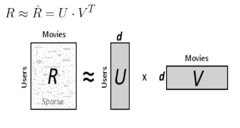
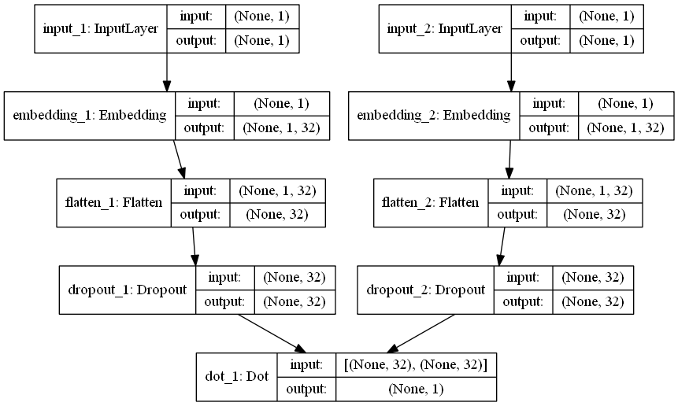
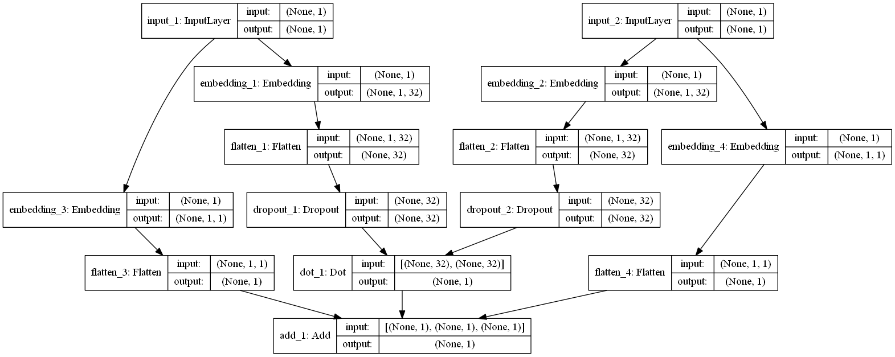
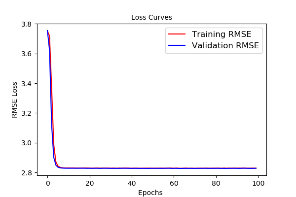
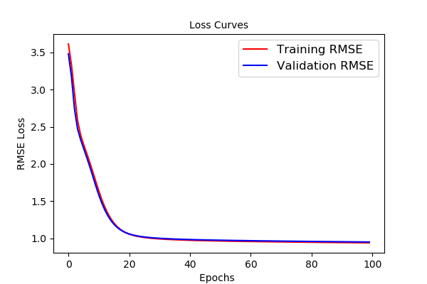
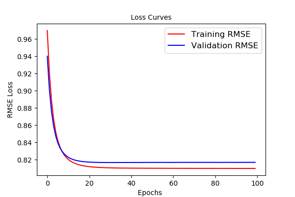
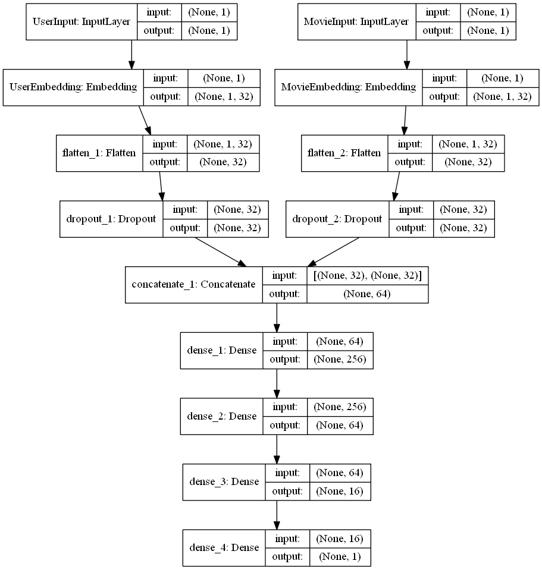
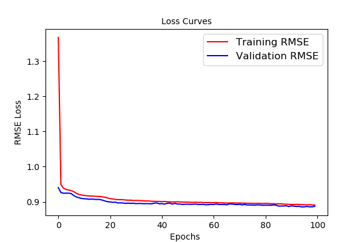
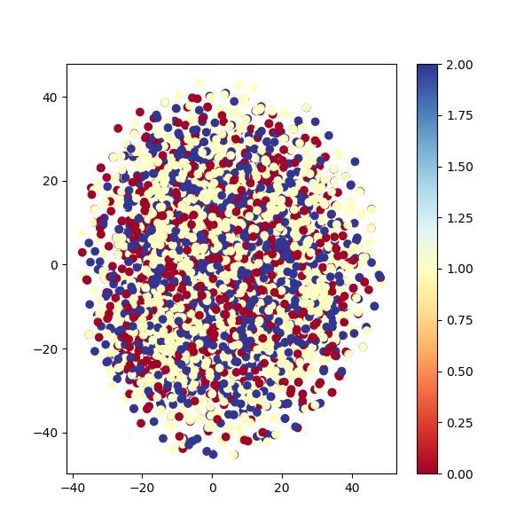

# Homework 5


## Purpose: Predict movie ratings

本次作業主要目標是利用 User 對 Movie 的歷史評分去預測 User 未曾觀看過 Movie 的評分。

- 下表為 User A 到 E 對 Movie 1 到 4 的評分，本次目標就是利用這些已知評分去預測 ? 的部分。
  

  <table style="width:80%">
    <tr>
      <td> </td> 
      <td> Movie 1 </td>
      <td> Movie 2 </td> 
      <td> Movie 3 </td> 
      <td> Movie 4 </td> 
    </tr>  
    <tr>
      <td>User 1</td>
      <td> 5 </td> 
      <td> 3 </td> 
      <td> ? </td> 
      <td> 1 </td> 
    </tr>   
    <tr>
      <td>User 2</td>
      <td> 4 </td> 
      <td> 3 </td> 
      <td> ? </td> 
      <td> 1 </td> 
    </tr>
    <tr>
      <td>User 3</td>
      <td> 1 </td> 
      <td> 1 </td> 
      <td> ? </td> 
      <td> 5 </td> 
    </tr>
    <tr>
      <td>User 4</td>
      <td> 1 </td> 
      <td> ? </td> 
      <td> 4 </td> 
      <td> 4 </td> 
    </tr>
    <tr>
      <td>User 5</td>
      <td> ? </td> 
      <td> 1 </td> 
      <td> 5 </td> 
      <td> 4 </td> 
    </tr>
  </table>

主要以 matrix factorization 的方法去預測 User-Movie matrix 的遺失值。下列利用一個簡單的例子來做說明。

- matrix factorization 的概念為，將上列表格式為一個 User-Movie matrix，並利用 svd 矩陣分解的概念將 User-Movie matrix 拆解成 User matrix 和 Movie matrix。

- 首先假設 u 個 User、m 部 Movie、d 個 latent factor、User-Movie matrix 為 、User matrix 為 、Movie matrix 為 。如下圖所示。
  <center>
    
  </center>
- 由於 User-Movie matrix 中存在遺失值，所以我們利用已知的評分去計算 loss function

   


## Data 簡介

* Training dataset 為 899873 筆資料，其中包含 6040 位 User 和 3883 部電影，其中 3688 部電影有評分資料。

* Movies dataset 中 movie ID 最大為 3952 但資料筆數只有 3883 部電影。

* Users dataset 中 user ID 最大為 6040，資料筆數也有 6040 為使用者。

* Testing dataset 則是 100336 筆資料， 其中一半為 kaggle private set。


## Summary

在這次大約 90 萬筆 Training dataset 裡面，我們將最後面 8 萬筆資料當作 validation set。

一開始我們從最基本的 matrix factorization 出發，模型結構如下圖，模型參數 311,296 個。

<center>
 
</center>

接下來我們增加模型的複雜度，在 User 和 Movie 分別增加 bias 項，模型參數 321,024 個。

<center>
  
</center>

### 1. 比較有無 Bias 項訓練的結果。
  * latent factor 為 32
  * Batch Size 為 4096
  * dropout 為 0.3
  * L2 regularizer 0.01
  * 針對所有的 training data 和 validation data 計算 MSE 和 RMSE
    <table style="width:80%">
      <tr>
      <td> </td> 
      <td> Training Loss </td>
      <td> Training RMSE </td> 
      <td> Valid Loss </td> 
      <td> Vaild RMSE </td> 
      </tr>
      <tr>
      <td>unBias</td>
      <td> 7.9396 </td> 
      <td> 2.818 </td> 
      <td> 7.9687 </td> 
      <td> 2.8224 </td> 
      </tr>
      <tr>
      <td>Bias</td>
      <td> 0.8824 </td> 
      <td> 0.9393 </td> 
      <td> 0.8813 </td> 
      <td> 0.9388 </td> 
      </tr>
    </table>

  下圖(左)為無 Bias 項的 MF，由 loss curves 可以得知模型大約在第 10 個 epoch 就已經收斂，RMSE 已經無法低於 2.8。下圖(右)為增加 Bias 項的 MF，增加 Bias 項提高模型的複雜度，使模型可以捕捉到更多訊息，這點可以在 loss curves 得知。RMSE 也由 2.8 降至 0.9，但也因為模型複雜度增加，模型大約到了第 40 個 epoch 才收斂。

  進一步解釋增加 Bias 項所帶來的效益，我們可以直觀的解釋成，每個 user 和 movie 對於 rate 都有不同的分布。更直觀的說就是 user 1 再給 rate 的時候可能以3分為基準，喜歡的電影就給4分，不喜歡則給2分，user 2 可能會是喜歡給5分，不喜歡給1分。增加 Bias 項，可以幫助模型捕捉到 user 之間對於給分傾向的差異，movie 的解釋也是雷同。

<div class="half">
    
    
</div>

###  2. 在有 Bias 的模型情況下，比較不同的 latent dimension 的結果。
  * 有 Bias 項
  * Batch Size 為 4096
  * dropout 為 0.3
  * L2 regularizer 0.01
  * 針對所有的 training data 和 validation data 在不同的 latent factor 計算 MSE 和 RMSE
    <table style="width:80%">
      <tr>
      <td> Latent Factor</td> 
      <td> Training Loss </td>
      <td> Training RMSE </td> 
      <td> Valid Loss </td> 
      <td> Vaild RMSE </td> 
      <td> time/epoch </td>
      </tr>
      <tr>
      <td> 16 </td>
      <td> 0.8788 </td> 
      <td> 0.9375 </td> 
      <td> 0.9192 </td> 
      <td> 0.9587 </td> 
      <td> 4 sec </td> 
      </tr>
      <tr>
      <td> 32 </td>
      <td> 0.8824 </td> 
      <td> 0.9393 </td> 
      <td> 0.8813 </td> 
      <td> 0.9388 </td> 
      <td> 5 sec </td>
      </tr>
      <tr>
      <td> 128 </td>
      <td> 0.8806 </td> 
      <td> 0.9384 </td> 
      <td> 0.9016 </td> 
      <td> 0.9495 </td> 
      <td> 10 sec </td>
      </tr>
      <tr>
      <td> 256 </td>
      <td> 0.8800 </td> 
      <td> 0.9381 </td> 
      <td> 0.9063 </td> 
      <td> 0.9520 </td> 
      <td> 16 sec </td>
      </tr>
      <tr>
      <td> 512 </td>
      <td> 0.8812 </td> 
      <td> 0.9387 </td> 
      <td> 0.8920 </td> 
      <td> 0.9444 </td>
      <td> 29 sec </td> 
      </tr>
    </table>
  在上述的設定下，latent factor 設定依序為16、32、128、256、512。根據上表可以得知不同 latent factor 似乎對於 RMSE 影響不大。但在訓練時間上差異就相當明顯，這結果也很值觀， latent factor 越大，代表模型參數越多，運算就更複雜，反之亦然。


### 3. 在模型有 Bias 項的情況下，比較有無 normalize(在 rating 上) 的差別。
  * latent factor 為 32
  * Batch Size 為 4096
  * dropout 為 0.3
  * L2 regularizer 0.01
  * 針對 ratting 做 Normalize 的具體作法
  * 算出 training data Ratting 的平均值 <a href="https://www.codecogs.com/eqnedit.php?latex=\mu" target="_blank"></a> 和標準差 <a href="https://www.codecogs.com/eqnedit.php?latex=\sigma" target="_blank"></a>
  * 對 training data 的 Ratting 做標準化

    <a href="https://www.codecogs.com/eqnedit.php?latex=R^{*}=\frac{R-\mu&space;}{\sigma&space;}" target="_blank"></a>

  * 最後針對預測的 <a href="https://www.codecogs.com/eqnedit.php?latex=R^{*}" target="_blank"></a> 反算回去原來的 ratting <a href="https://www.codecogs.com/eqnedit.php?latex=R" target="_blank"></a>

    <a href="https://www.codecogs.com/eqnedit.php?latex=R=R^{*}\times&space;\sigma&space;&plus;&space;\mu" target="_blank"></a>
  * 針對所有的 training data 和 validation data 計算 MSE 和 RMSE
    <table style="width:80%">
      <tr>
      <td> </td> 
      <td> Training Loss </td>
      <td> Training RMSE </td> 
      <td> Valid Loss </td> 
      <td> Vaild RMSE </td> 
      </tr>
      <tr>
      <td>unNormalize</td>
      <td> 0.8824 </td> 
      <td> 0.9393 </td> 
      <td> 0.8813 </td> 
      <td> 0.9388 </td> 
      </tr>
      <tr>
      <td>Normalize</td>
      <td> 0.8182 </td> 
      <td> 0.9045 </td> 
      <td> 0.8234 </td> 
      <td> 0.9077 </td> 
      </tr>
      </table>
  
  根據上表可以得知有對 ratting 做 normalize 可以有效地降低 RMSE。

  下圖(左)為無 normalize 的 MF，RMSE 極限大約是0.9左右，下圖(右)為 normalize 的 MF，RMSE 下降至0.82，是因為對 ratting 做 normalize 使得 ratting 從原本的0、1...4、5變成接近0的數字，因此讓 RMSE 變小。在這種情況下比較 RMSE 是沒有意義的，但可以由 loss curves 的斜率可以確定的是增加 normalize 使得收斂的速度比較快。
  
  另外針對有做 normalize MF 的 loss curves 可以進行更進一步的調參，使訓練過程收斂更漂亮，在這沒有進一步調參主要是因為想要觀察在模型固定得情況下對 ratting normalize 所造成的影響。
  
<div class="half">
    
    
</div>

最後我們嘗試使用 DNN 來預測 ratting。模型結構如下圖所示
，模型參數 345,441 個。

<center>
  
</center>

### 4. 比較 DNN 和 MF(有 Bias 項) 的差別
  * 沒有對 ratting 做 Normalize
  * latent factor 為 32
  * Batch Size 為 4096
  * 針對所有的 training data 和 validation data 計算 MSE 和 RMSE
    <table style="width:80%">
      <tr>
      <td> </td> 
      <td> Training Loss </td>
      <td> Training RMSE </td> 
      <td> Valid Loss </td> 
      <td> Vaild RMSE </td> 
      </tr>
      <tr>
      <td>DNN</td>
      <td> 0.7436 </td> 
      <td> 0.8622 </td> 
      <td> 0.7872 </td> 
      <td> 0.8872 </td> 
      </tr>
      <tr>
      <td>MF</td>
      <td> 0.8182 </td> 
      <td> 0.9045 </td> 
      <td> 0.8234 </td> 
      <td> 0.9077 </td> 
      </tr>
    </table>
   下圖(左)為 DNN，RMSE 到第40個 epoch 似乎達到極限0.88左右，相較於右圖 MF，RMSE 明顯較小，整體而已 DNN 似乎表現得比較優異，但訓練時間 DNN 相對就比較耗時。 

<div class="half">
    
    
</div>

### 5. 嘗試利用 tsen 將 movie 的 embedding 降維，再以 movie category 當作 label 來作圖

我將 18 種 genre 歸類成 Format、Setting、Mood 三大主題。再將每一部電影進行貼標籤的動作，最後利用 TSEN 將 movie embedding 降維，但效果似乎不是很好，之後可以在嘗試看其他種主題。

<table style="center">
  <tr>
  <td> Label </td> 
  <td> Genre </td>
  </tr>
  <tr>
  <td>Format</td>
  <td> Animation|Children's|Drama|Musical|Documentary </td> 
  </tr>
  <tr>
  <td>Setting</td>
  <td> Action|Adventure|Fantasy|Sci-Fi|Thriller|War|Mystery </td> 
  </tr>
  <tr>
  <td>Mood</td>
  <td> Comedy|Romance|Crime|Horror|Film-Noir </td> 
  </tr>
  </table>

<center>
  
</center>


## File Stucture

```
HW5
|    README.md
|    main.py
|    test.py
|
└─── Base
|      __init__.py
|      DataProcessing.py
|      Utility.py
|      Model.py
|      Train.py
|      Plot.py
|      Predict.py
|
└─── 01-Data
|       train.csv
|       users.csv
|       movies.csv
|       test.csv
|       SampleSubmisson.csv
|
└─── 02-Output
|       ...
|___
```

## Reference

* [原始課程作業說明](https://docs.google.com/presentation/d/10a1ET-9m3ntQhGesxCpQOqPtab4ldUBBrq-i3o-h2HE/edit#slide=id.g2b65c05370_1_5)

* [Collaborative filtering in Keras](http://www.fenris.org/2016/03/07/index-html)

* [Recommender Systems in Keras](https://nipunbatra.github.io/blog/2017/recommend-keras.html)

* [T-SNE](https://medium.com/@luckylwk/visualising-high-dimensional-datasets-using-pca-and-t-sne-in-python-8ef87e7915b)
